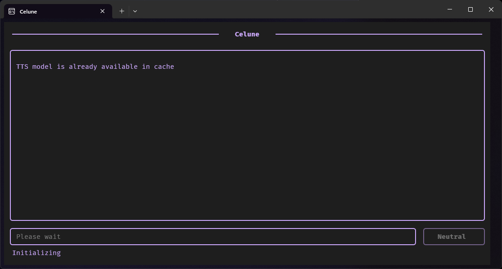
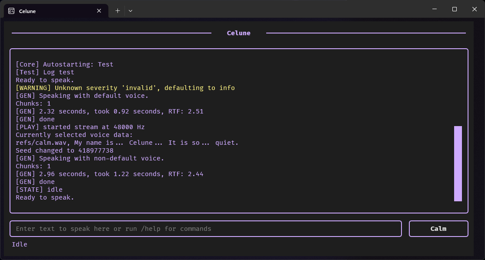
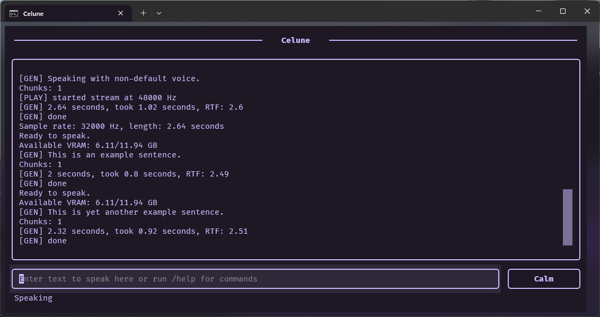
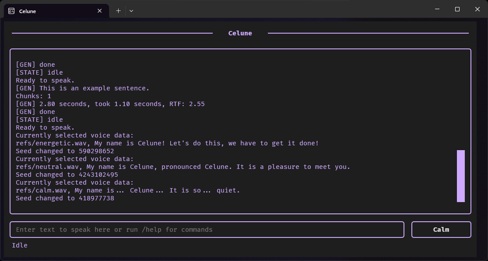
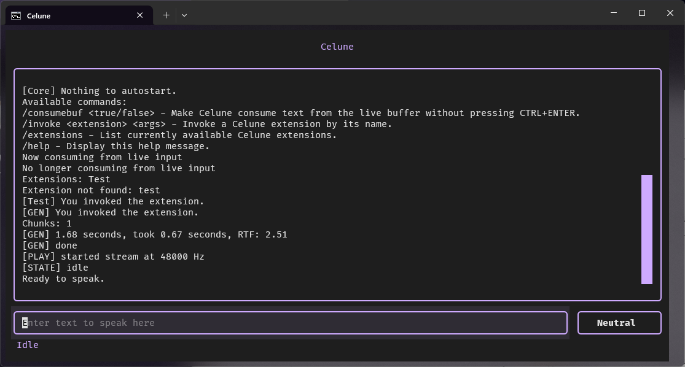
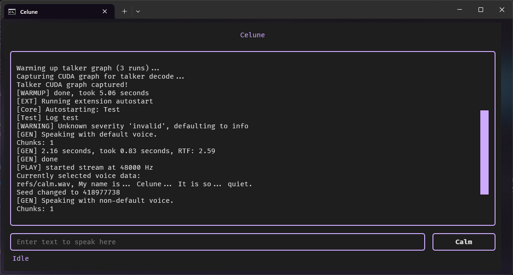
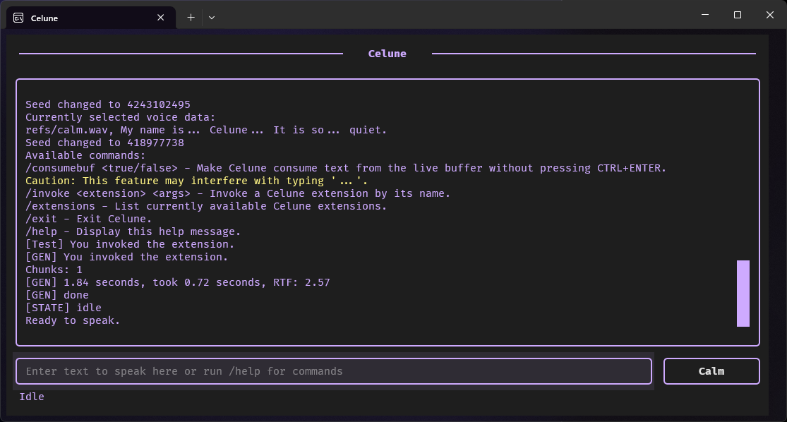

# Celune
Celune is a real-time AI TTS engine focused on natural voice delivery, low-latency playback, and distinct voice styles.

It has been designed for real-time performance on consumer GPUs.

## Features

- Real-time speech generation pipeline
- Distinct voice styles (Calm, Neutral, Energetic)
- Stable long-form narration without drift
- Source-level audio control (no post-processing)
- GPU-accelerated inference

## Voices & samples
Each voice is demonstrated using a short introduction and a longer narration sample to showcase consistency, pacing, and expressiveness.

| Voice     | Intro | Narration |
|-----------|-------|-----------|
| Neutral   | [▶️ Play](https://gabalpha.github.io/read-audio/?p=https://raw.githubusercontent.com/celunah/celune/main/demos/neutral_sc.wav) | [▶️ Play](https://gabalpha.github.io/read-audio/?p=https://raw.githubusercontent.com/celunah/celune/main/demos/neutral_lc.wav) |
| Calm      | [▶️ Play](https://gabalpha.github.io/read-audio/?p=https://raw.githubusercontent.com/celunah/celune/main/demos/calm_sc.wav)    | [▶️ Play](https://gabalpha.github.io/read-audio/?p=https://raw.githubusercontent.com/celunah/celune/main/demos/calm_lc.wav)    |
| Energetic | [▶️ Play](https://gabalpha.github.io/read-audio/?p=https://raw.githubusercontent.com/celunah/celune/main/demos/energetic_sc.wav) | [▶️ Play](https://gabalpha.github.io/read-audio/?p=https://raw.githubusercontent.com/celunah/celune/main/demos/energetic_lc.wav) |

> [!CAUTION]
> Mixing too many languages in input to Celune may cause unexpected output, ie. hallucination.

Samples were captured directly from the live TTS pipeline with no post-processing applied (only silence trimming).

For details on voice production, check the VOICES.md file.

## System Requirements

Celune depends on external system tools that are not installed via `pip`:

- **NVIDIA GPU with CUDA support**
- **CUDA Toolkit 12.8**
- **SoX (Sound eXchange)** — required for audio processing
- **Symbolic link support** (recommended on Windows)

Celune requires CUDA for GPU acceleration. CPU-only execution is not supported.

## GPU requirements

**GPU (CUDA):**
- Minimum: 6 GB VRAM (e.g. GTX 1660 / RTX 2060)
- Recommended: 8 GB+ VRAM (e.g. RTX 3060 or better)

Celune’s core model fits within ~4 GB VRAM, but additional memory is required for runtime overhead, buffering, and stable real-time playback.

Tested on: RTX 5070 (12 GB VRAM)

## Installation

```bash
# Download Celune
git clone https://github.com/celunah/celune

# Create environment
python -m venv .venv
source .venv/bin/activate

# Or on Windows:
.venv\Scripts\activate

# Install packages
pip install -U -r requirements.txt

# Run
python main.py

# Or on Unix systems:
chmod +x main.py
./main.py
```

### SoX installation
If SoX is already installed, you can skip this section.

**Windows (Scoop)**
```powershell
# Install Scoop if you don't already have it
Set-ExecutionPolicy -ExecutionPolicy RemoteSigned -Scope CurrentUser
irm https://get.scoop.sh | iex

# Install SoX
scoop install sox
```

**Linux (Debian/Ubuntu)**
```bash
sudo apt install sox
```

**macOS (Homebrew)**
```bash
# Install Homebrew if you don't already have it
/bin/bash -c "$(curl -fsSL https://raw.githubusercontent.com/Homebrew/install/HEAD/install.sh)"

# Install SoX
brew install sox
```

**Validate SoX is installed**
```bash
sox --version

# Expected output:
sox:      SoX v14.4.2 (or similar version)
```

### CUDA 12.8 installation

Download and install CUDA Toolkit 12.8 from NVIDIA:

https://developer.nvidia.com/cuda-12-8-0-download-archive

Make sure to:
- Select the correct OS and version
- Install both **CUDA Toolkit** and **NVIDIA drivers** (if not already installed)

After installation, verify CUDA:

```bash
nvidia-smi
```

You should see your GPU listed along with driver information.

### Symbolic links (Windows)

Symbolic links are recommended for best performance and compatibility.

To enable them:
- Enable **Developer Mode** in Windows settings  
  (Settings → Privacy & Security → For Developers)

Without this, Celune may require elevated permissions or fall back to slower behavior.

# Screenshots
These screenshots show Celune's user interface.

### Before init
[](./demos/state_before_init.png)

### Ready
[](./demos/state_ready.png)

### Talking
[](./demos/state_talking.png)

### Change voice
[](./demos/state_change_voice.png)

### Commands
[](./demos/state_commands.png)

### Extension autostart
[](./demos/state_extension_autostart.png)

### Extension invoke
[](./demos/state_extension_invoke.png)

