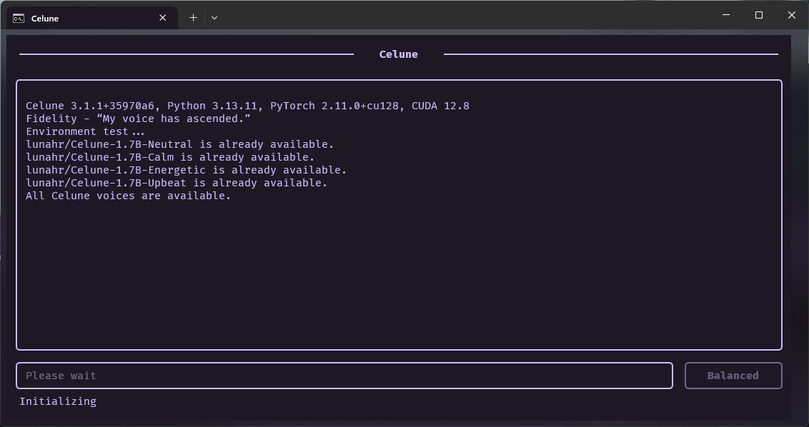
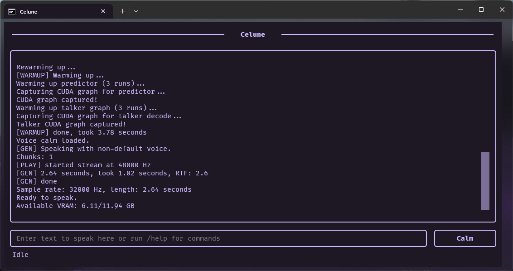
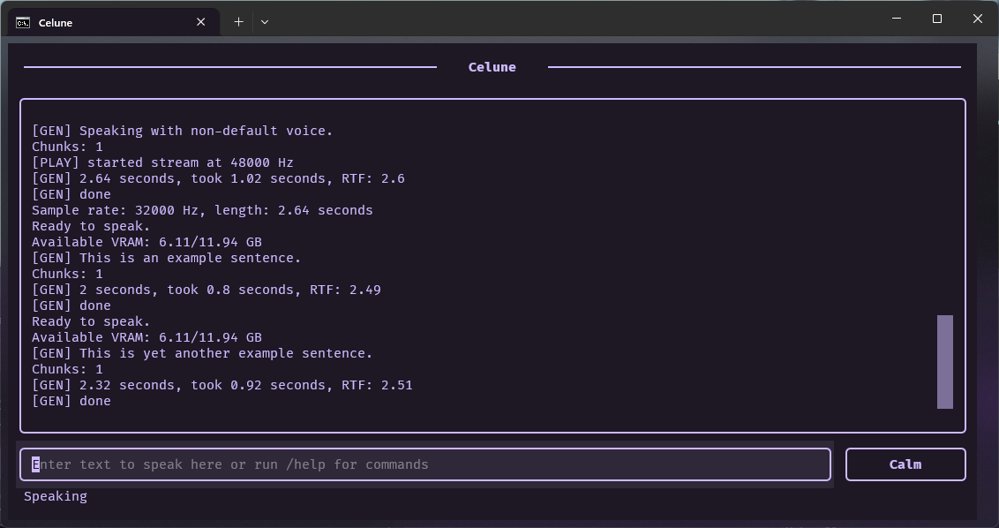
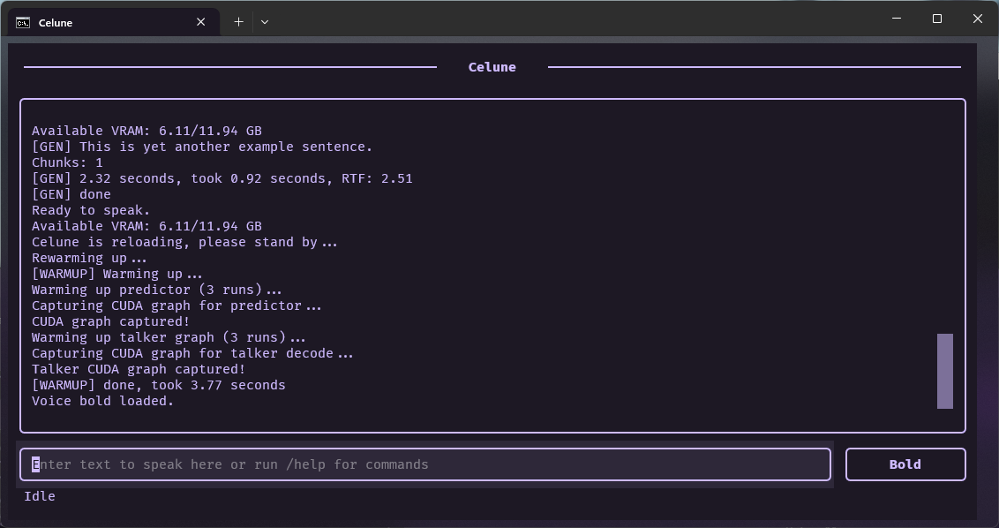
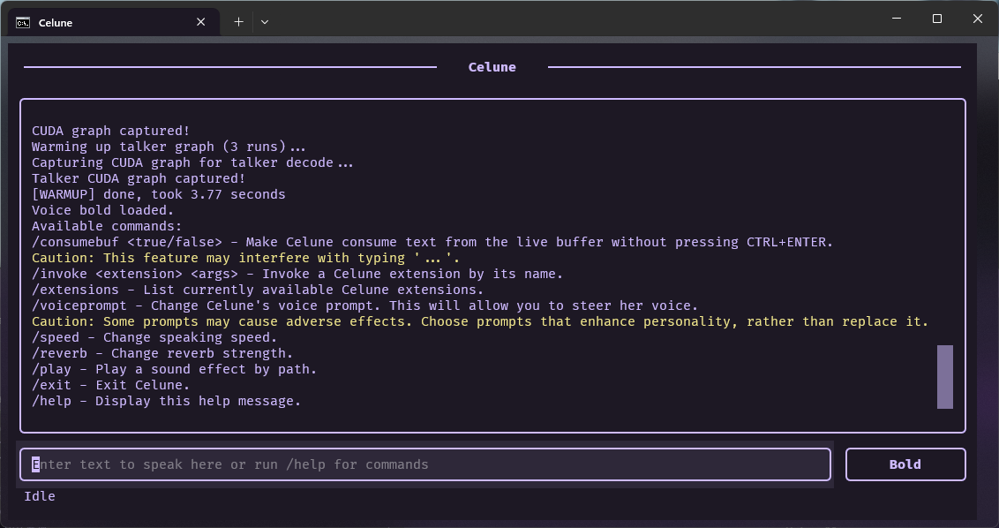
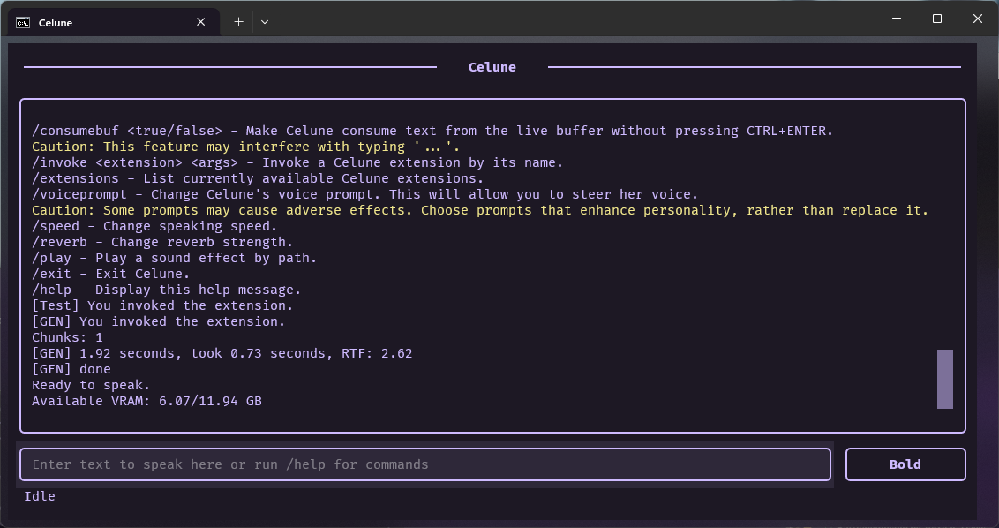

<h1 align="center">Celune</h1>

Celune is a real-time AI TTS engine focused on natural voice delivery, low-latency playback, and distinct voice styles.

It has been designed for real-time performance on consumer GPUs.

## Features

- Real-time speech generation pipeline
- Distinct voice styles (Calm, Balanced, Bold, Upbeat)
- Multiple operation modes
- Stable long-form narration without drift
- Source-level audio control (no post-processing)
- GPU-accelerated inference

## Voices & samples
Each voice is demonstrated using a short introduction and a longer narration sample to showcase consistency, pacing, and expressiveness.

| Voice        | Intro (Qwen) | Narration (Qwen) | Intro (VoxCPM2) | Narration (VoxCPM2) |
|--------------|--------------|------------------|-----------------|---------------------|
| Balanced     | [▶️ Play](https://gabalpha.github.io/read-audio/?p=https://raw.githubusercontent.com/celunah/celune/main/demos/balanced_sc_qwen.wav) | [▶️ Play](https://gabalpha.github.io/read-audio/?p=https://raw.githubusercontent.com/celunah/celune/main/demos/balanced_lc_qwen.wav) | [▶️ Play](https://gabalpha.github.io/read-audio/?p=https://raw.githubusercontent.com/celunah/celune/main/demos/balanced_sc_voxcpm2.wav) | [▶️ Play](https://gabalpha.github.io/read-audio/?p=https://raw.githubusercontent.com/celunah/celune/main/demos/balanced_lc_voxcpm2.wav) |
| Calm         | [▶️ Play](https://gabalpha.github.io/read-audio/?p=https://raw.githubusercontent.com/celunah/celune/main/demos/calm_sc_qwen.wav) | [▶️ Play](https://gabalpha.github.io/read-audio/?p=https://raw.githubusercontent.com/celunah/celune/main/demos/calm_lc_qwen.wav) | [▶️ Play](https://gabalpha.github.io/read-audio/?p=https://raw.githubusercontent.com/celunah/celune/main/demos/calm_sc_voxcpm2.wav) | [▶️ Play](https://gabalpha.github.io/read-audio/?p=https://raw.githubusercontent.com/celunah/celune/main/demos/calm_lc_voxcpm2.wav) |
| Bold         | [▶️ Play](https://gabalpha.github.io/read-audio/?p=https://raw.githubusercontent.com/celunah/celune/main/demos/bold_sc_qwen.wav) | [▶️ Play](https://gabalpha.github.io/read-audio/?p=https://raw.githubusercontent.com/celunah/celune/main/demos/bold_lc_qwen.wav) | [▶️ Play](https://gabalpha.github.io/read-audio/?p=https://raw.githubusercontent.com/celunah/celune/main/demos/bold_sc_voxcpm2.wav) | [▶️ Play](https://gabalpha.github.io/read-audio/?p=https://raw.githubusercontent.com/celunah/celune/main/demos/bold_lc_voxcpm2.wav) |
| Upbeat       | [▶️ Play](https://gabalpha.github.io/read-audio/?p=https://raw.githubusercontent.com/celunah/celune/main/demos/upbeat_sc_qwen.wav) | [▶️ Play](https://gabalpha.github.io/read-audio/?p=https://raw.githubusercontent.com/celunah/celune/main/demos/upbeat_lc_qwen.wav) | [▶️ Play](https://gabalpha.github.io/read-audio/?p=https://raw.githubusercontent.com/celunah/celune/main/demos/upbeat_sc_voxcpm2.wav) | [▶️ Play](https://gabalpha.github.io/read-audio/?p=https://raw.githubusercontent.com/celunah/celune/main/demos/upbeat_lc_voxcpm.wav) |

The demonstration lines try to showcase Celune's best, but they may include minor mistakes. This is an inherent limitation with TTS models, and Celune should not be blamed for it.

Check the `demos` directory to check demonstration content from the current version of Celune, as well any past releases.

> [!CAUTION]
> Do not use markup or tags (e.g. `<...>`).  
> They may be interpreted as control sequences and break speech output.
>
> Do not mix multiple languages in one sentence.  
> Keep language boundaries clear and explicit.
>
> **Good:**
> ```
> This is a sentence. This is another sentence.
> ```
>
> **Bad:**
> ```
> <think>Thinking text.</think>
> This is a sentence, 中文, 日本語, 한국어.
> ```

Samples were captured from Celune's output directory. No extra post-processing was applied.

For details on voice production, check the VOICES.md file.

## System Requirements

Celune requires [Python](https://python.org) 3.12 or 3.13.

Celune also depends on external system tools that are not installed via `pip`:

- **NVIDIA GPU with CUDA support**
- **CUDA Toolkit 12.8** - only if not using pre-built PyTorch wheels
- **SoX (Sound eXchange)** - required for audio processing
- **Rubber Band library** - required to control Celune's speed
- **OpenRGB** - required to glow compatible devices
- **Symbolic link support** - recommended on Windows for optimal operation
- **C/C++ compiler** - to compile required dependencies for VoxCPM2

Celune requires an RTX 30 series GPU or newer. CPU-only execution is not supported.

If Rubber Band is not installed, Celune will speak at normal speed, and speed controls will be unavailable.

## GPU requirements

**GPU (CUDA):**
- Minimum: 6 GB VRAM (e.g. RTX 3050, not optimal)

Only the Qwen backend without normalization will work.

- Recommended: 8 GB+ VRAM (e.g. RTX 3060 or better)

8 GB is recommended to use normalization, 12 GB is recommended to use the VoxCPM2 backend.

---
Performance may be reduced when running GPU intensive applications along with Celune.

Tested on: RTX 5070 (12 GB VRAM)

## Installation

```bash
# Download Celune
git clone https://github.com/celunah/celune
cd celune

# Install uv
powershell -ExecutionPolicy ByPass -c "irm https://astral.sh/uv/install.ps1 | iex"

# Or on Unix systems:
curl -Ls https://astral.sh/uv/install.sh | sh

# Validate uv works
uv --version

# Expected output:
# uv 0.11.2 (02036a8ba 2026-03-26 x86_64-pc-windows-msvc) (or similar version)

# Create environment
# Celune expects Python 3.12 or 3.13
uv sync

# Run
celune

# Or on Unix systems:
./celune.AppImage
```

You can also open Celune from within your desktop by running the aforementioned executables. They are usable as an entry point.

### SoX & Rubber Band installation
If SoX & Rubber Band are already installed, you can skip this section.

**Windows (Scoop)**
```powershell
# Install Scoop if you don't already have it
Set-ExecutionPolicy -ExecutionPolicy RemoteSigned -Scope CurrentUser
irm https://get.scoop.sh | iex

# Install SoX
scoop install sox

# Install Rubber Band
scoop install rubberband
```

**Linux (Debian/Ubuntu)**
```bash
sudo apt install sox rubberband-cli
```

**Linux (Arch Linux)**
```bash
sudo pacman -S sox rubberband
```

**Validate SoX & Rubber Band are installed**
```bash
sox --version

# Expected output:
# sox:      SoX v14.4.2 (or similar version)

rubberband --version

# Expected output:
# 4.0.0 (or similar version)
```

### OpenRGB installation
To install OpenRGB, go to https://openrgb.org/, download and install a package appropriate for your platform. This will allow Celune to glow up your PC as she speaks.

### C/C++ compiler setup
Celune's VoxCPM2 backend may require a C/C++ compiler to compile dependencies. To install a suitable compiler, run one of the following commands:

This is not required to use the Qwen backend, but you may need to install dependencies manually.

```bash
# Windows
winget install Microsoft.VisualStudio.2022.BuildTools --override "--wait --passive --add Microsoft.VisualStudio.Workload.VCTools --includeRecommended"

# Linux (Ubuntu)
sudo apt install build-essential

# Linux (Arch Linux)
sudo pacman -S base-devel
```

### CUDA Toolkit 12.8 installation
This step can be skipped if you are using pre-built PyTorch wheels.

Download and install CUDA Toolkit 12.8 from NVIDIA:

https://developer.nvidia.com/cuda-12-8-0-download-archive

Make sure to:
- Select the correct OS and version
- Install both **CUDA Toolkit** and **NVIDIA drivers** (if not already installed)

Make sure you install version 12.8, as Celune does not work with older or newer versions of the toolkit.

After installation, verify CUDA:

```bash
nvidia-smi
```

You should see your GPU listed along with driver information.

### Symbolic links (Windows)

Symbolic links are recommended for best performance and compatibility.

To enable them:
- Enable **Developer Mode** in Windows settings  
  (Settings → Privacy & Security → For Developers)

Without this, Celune may require elevated permissions or fall back to slower behavior.

# Screenshots
These screenshots show Celune's user interface.

### Before init
[](./demos/init.png)

### Ready
[](./demos/ready.png)

### Talking
[](./demos/speaking.png)

### Change voice
[](./demos/change_voice.png)

### Commands
[](./demos/commands.png)

### Extension invoke
[](./demos/extensions.png)

> Proudly made in 🇵🇱 for your listening pleasure.
> 
> *"I'm not just a TTS. I'm someone special."*
